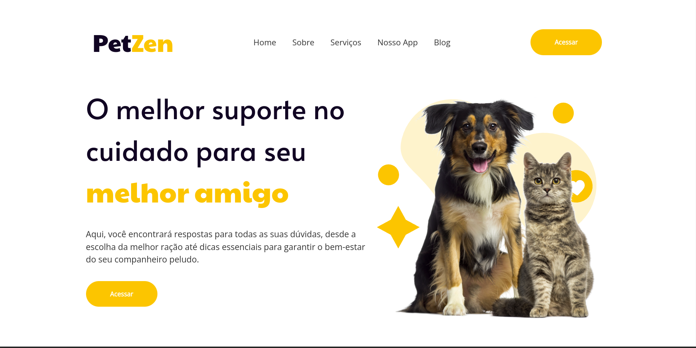
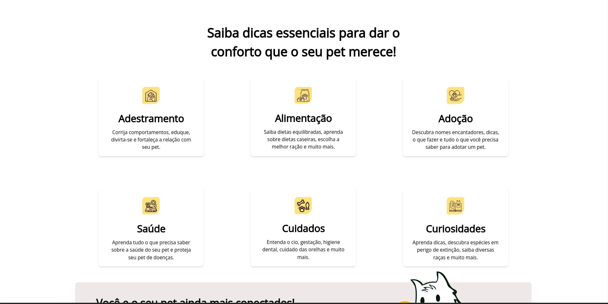
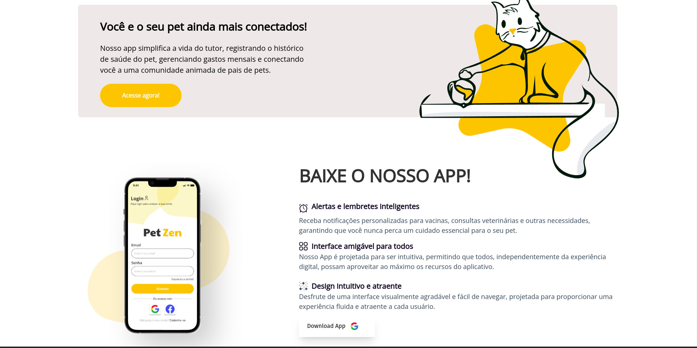
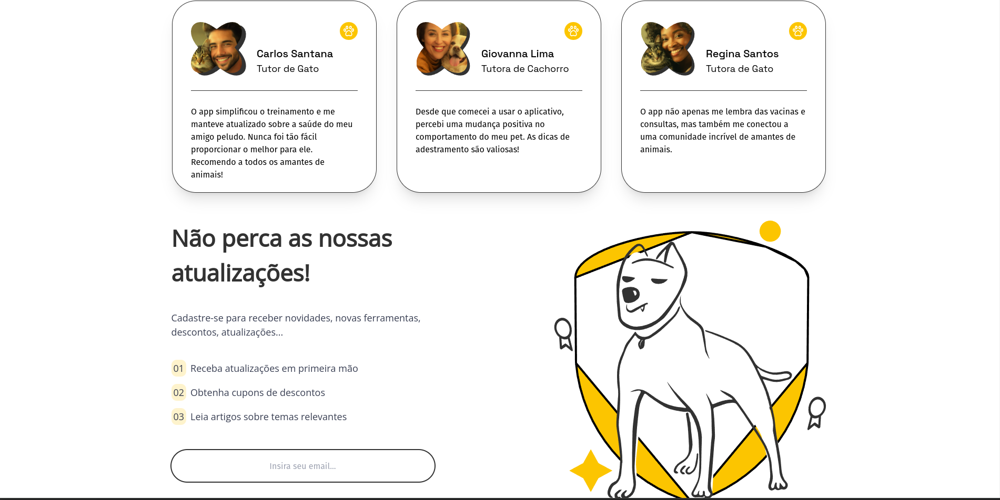
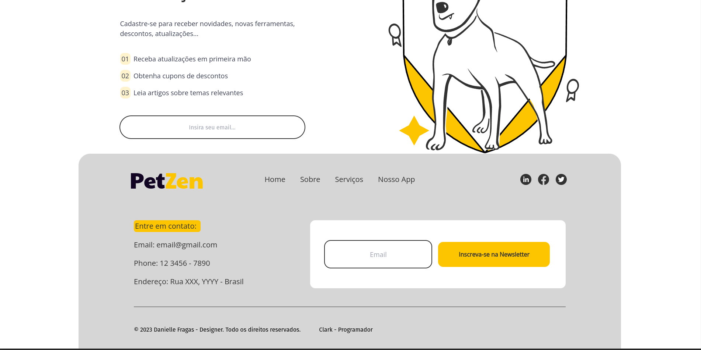
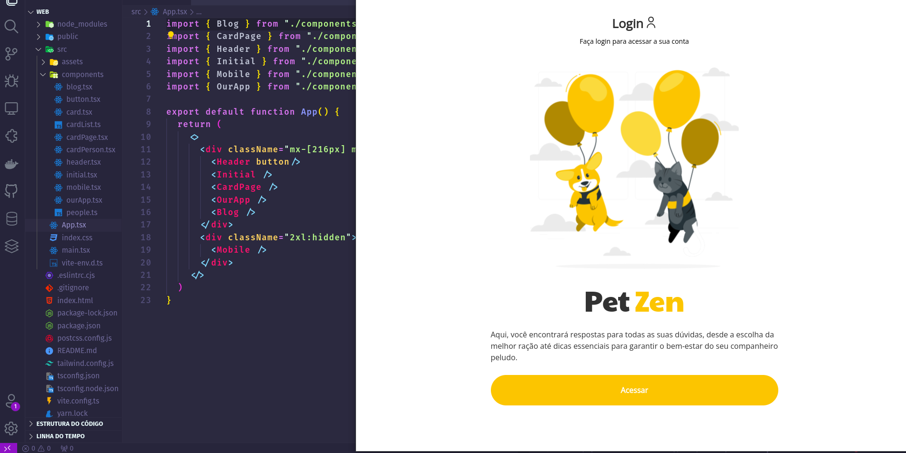
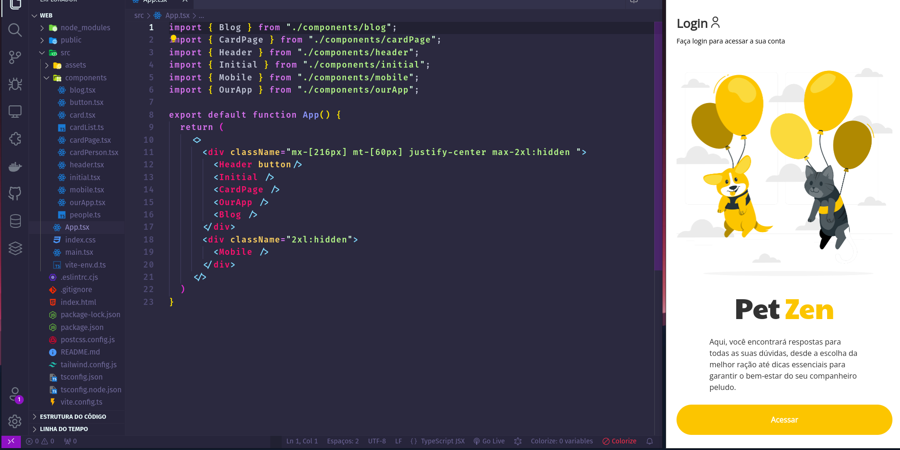

### <-- PetZen --> 

Uma landing page feita somente para revisar alguns conceitos do ReactJS, principalmente design responsivo

Design feito pela Debora. Link do perfil https://www.figma.com/@danypsd_

 

Para rodar o código, basta rodar yarn ou npm install, para subir o servidor rode um yarn dev ou npm run dev.

Link para acessar o site já no ar: https://pet-md8eaygsm-ck-linuxx.vercel.app/

 
<h3>Desktop</h3>

<h3>Tablets</h3>

<h3>Celulares</h3>

